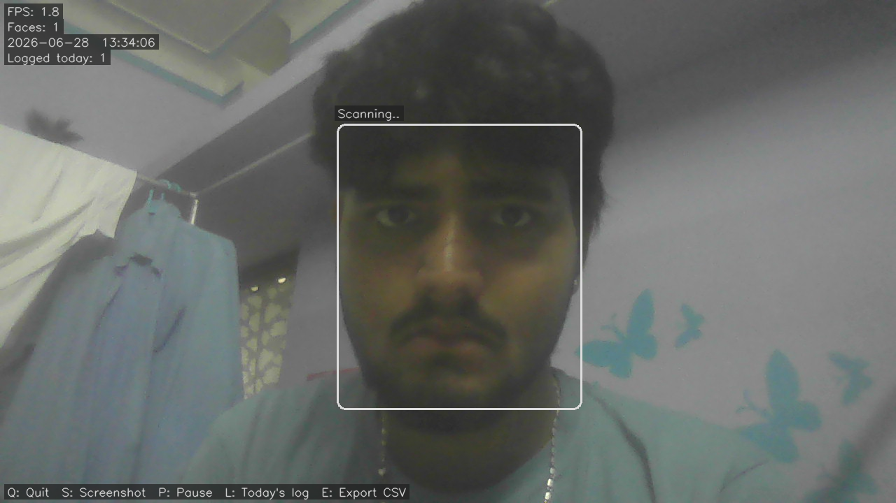
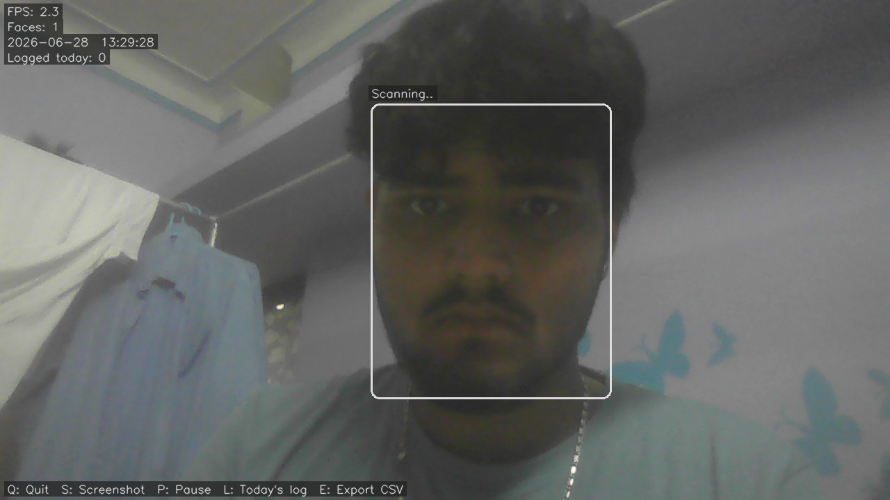
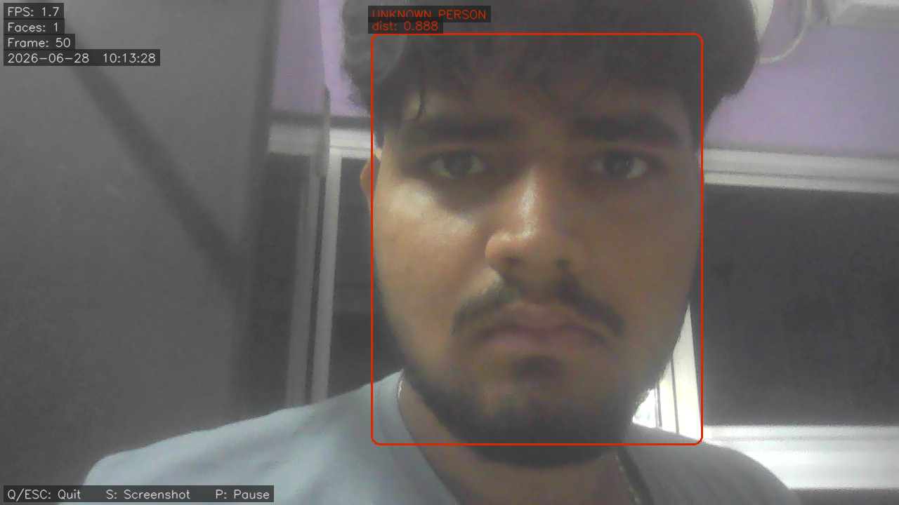

# Face Recognition Attendance System

A real-time face recognition system built with ArcFace and PostgreSQL. It detects, verifies, and logs faces from a live webcam feed, with anti-spoofing protection to block photos, screen replays, and masks.

---

## Screenshots


*Live camera feed — green box shows a verified face with employee ID and cosine distance*


*White box while the system scans a newly detected face*


*Enrollment mode — oval guide helps position the face before capture*

---

## Features

- **Live face verification** from webcam with real-time bounding boxes
- **Anti-spoofing** — rejects printed photos, screen replays, and 3D masks
- **Live enrollment** — add new people directly from the camera without taking photos separately
- **Attendance logging** — every verified face is timestamped and stored with a 60-second cooldown
- **CSV export** — full attendance history exportable on demand
- **Encrypted embeddings** — optional Fernet encryption for stored face vectors
- **Offline fallback** — `compare_within_file.py` runs without the database

---

## Architecture

```
faces/ (JPEG images)
    ↓  create_embeddings.py      ArcFace → 512-dim vectors
embeddings/ (.npy files)
    ↓  naming.py                 Anonymise filenames
    ↓  convert_npy_to_psql.py
PostgreSQL + pgvector            employee_embeddings table
    ↓
live_camera_with_log.py
    ├── Face detection            every frame  (~20ms)
    ├── Anti-spoof liveness       every 15 frames
    ├── ArcFace embedding         every 15 frames
    ├── Cosine distance search    <=> operator, threshold 0.35
    └── Attendance log            attendance_log table, 60s cooldown
```

---

## Tech Stack

| Component | Technology |
|-----------|------------|
| Face recognition | InsightFace — ArcFace (buffalo_l) |
| Anti-spoofing | InsightFace — MiniFASNet (antispoof) |
| Vector search | PostgreSQL 17 + pgvector |
| Database client | psycopg2 + pgvector-python |
| Camera / video | OpenCV |
| Encryption | cryptography (Fernet) |
| Infrastructure | Docker + Docker Compose |

---

## Setup

### Prerequisites

- Python 3.9+
- Docker Desktop

### 1. Clone

```bash
git clone https://github.com/your-username/Face-rec.git
cd Face-rec
```

### 2. Install dependencies

```bash
pip install -r requirements.txt
```

### 3. Configure environment

```bash
cp .env.example .env
```

Edit `.env` and set `DB_PASSWORD`.

### 4. Start the database

```bash
docker compose up -d
```

### 5. Seed the schema

```bash
docker exec -i pgvec psql -U postgres visit_db < visit_db.sql
```

### 6. Download the model

```bash
python download_model.py
```

---

## Usage

### Enroll new faces

```bash
python enroll_camera.py
```

Opens the camera. Type an Employee ID in the terminal, align the face in the oval guide, press **Space** to capture.

### Run live recognition with attendance logging

```bash
python live_camera_with_log.py
```

| Key | Action |
|-----|--------|
| `Q` / `ESC` | Quit |
| `S` | Screenshot |
| `P` | Pause / resume |
| `L` | Print today's attendance in terminal |
| `E` | Export full attendance log to CSV |

### Single image verification

```bash
python compare.py path/to/image.jpg
```

### View or export attendance

```bash
python attendance_log.py             # today's log
python attendance_log.py --export    # CSV export
python attendance_log.py --clear     # delete all records
```

---

## Enrollment pipeline (batch)

Run in order when enrolling from a folder of images:

```bash
python create_embeddings.py      # generate .npy embeddings
python naming.py                 # anonymise filenames
python convert_npy_to_psql.py   # insert into database
```

---

## Configuration

All settings are in `.env`:

| Variable | Default | Description |
|----------|---------|-------------|
| `DB_HOST` | localhost | PostgreSQL host |
| `DB_NAME` | visit_db | Database name |
| `DB_USER` | postgres | DB user |
| `DB_PASSWORD` | — | Required |
| `DB_PORT` | 55432 | Exposed port |
| `IMAGE_FOLDER` | faces | Source JPEG folder |
| `EMBEDDING_FOLDER` | embeddings | .npy storage |
| `LIVENESS_THRESHOLD` | 0.5 | Anti-spoof cutoff (0–1) |
| `MATCH_THRESHOLD` | 0.35 | Cosine distance cutoff |

---

## Database schema

```sql
CREATE TABLE employee_embeddings (
    emp_id    TEXT PRIMARY KEY,
    embedding VECTOR(512)
);

CREATE TABLE attendance_log (
    id         SERIAL PRIMARY KEY,
    emp_id     TEXT        NOT NULL,
    seen_at    TIMESTAMPTZ NOT NULL DEFAULT NOW(),
    distance   FLOAT,
    camera_idx INTEGER DEFAULT 0
);
```

---

## Project structure

```
Face-rec/
├── live_camera_with_log.py   Main production script
├── enroll_camera.py          Live enrollment via webcam
├── attendance_log.py         Attendance viewer / exporter
├── compare.py                Single image verification (DB)
├── compare_within_file.py    Single image verification (no DB)
├── create_embeddings.py      Batch embedding from folder
├── single_embeddings.py      Single image embedding
├── naming.py                 Anonymise embedding filenames
├── convert_npy_to_psql.py   Migrate .npy files to PostgreSQL
├── download_model.py         Download ArcFace model
├── encrypted_embeddings.py   Encrypted embedding storage
├── docker-compose.yml
├── requirements.txt
├── .env.example
├── visit_db.sql              Database seed
├── faces/                    Source images
├── embeddings/               .npy face vectors
├── enrolled_photos/          Reference photos from enrollment
└── screenshots/              Camera captures
```